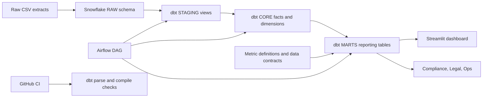
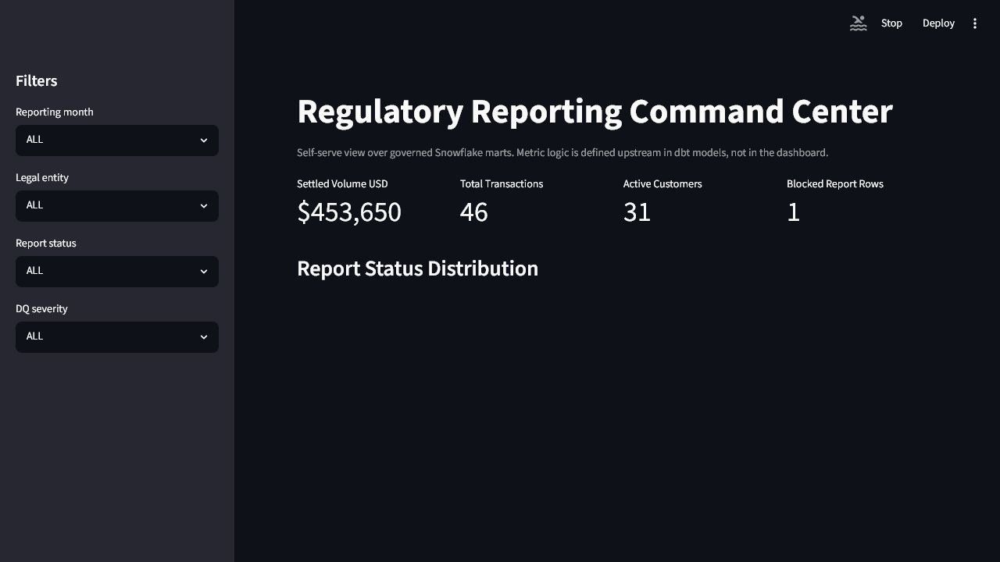
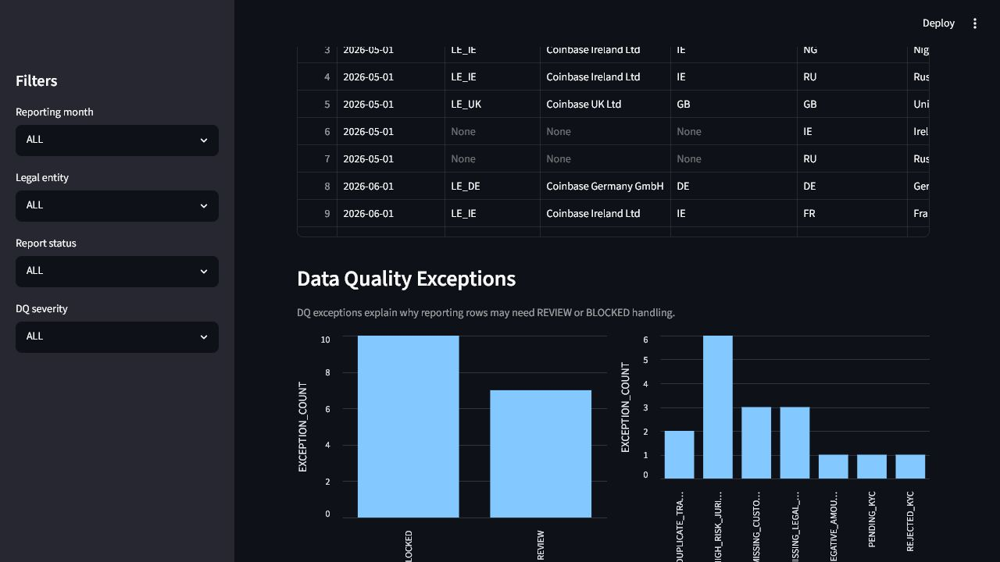
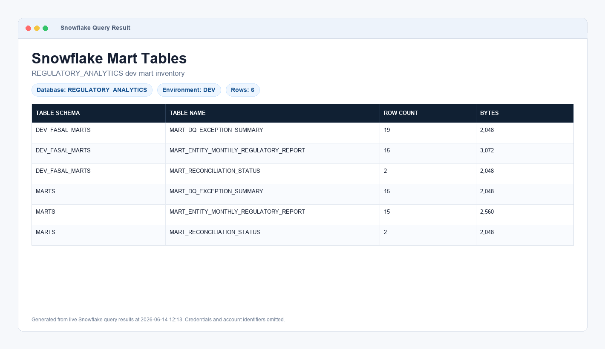
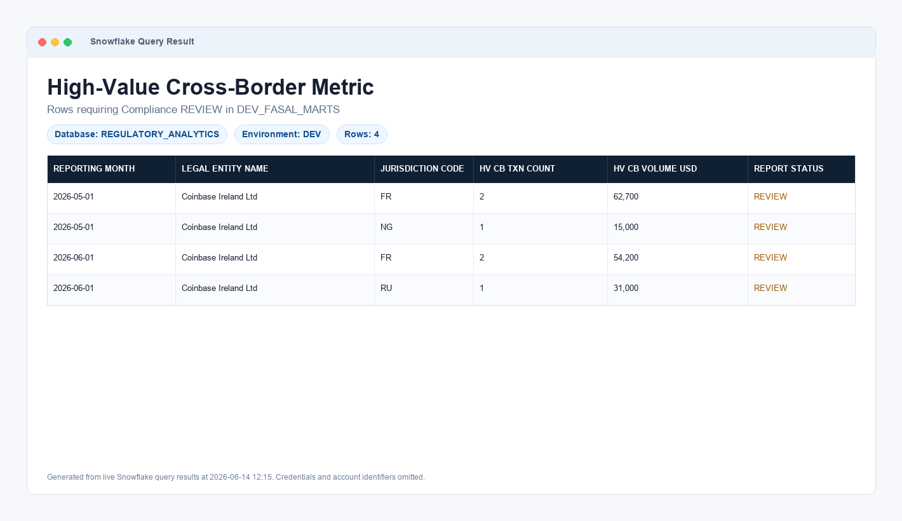
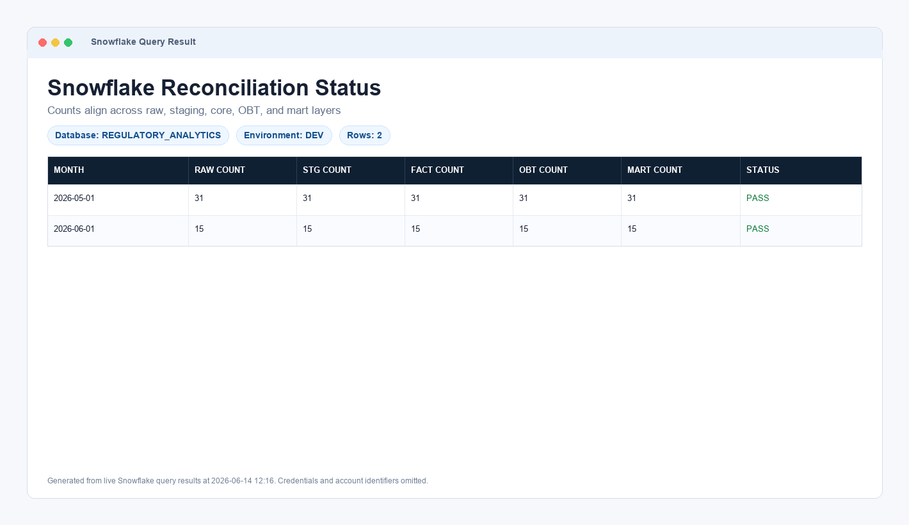
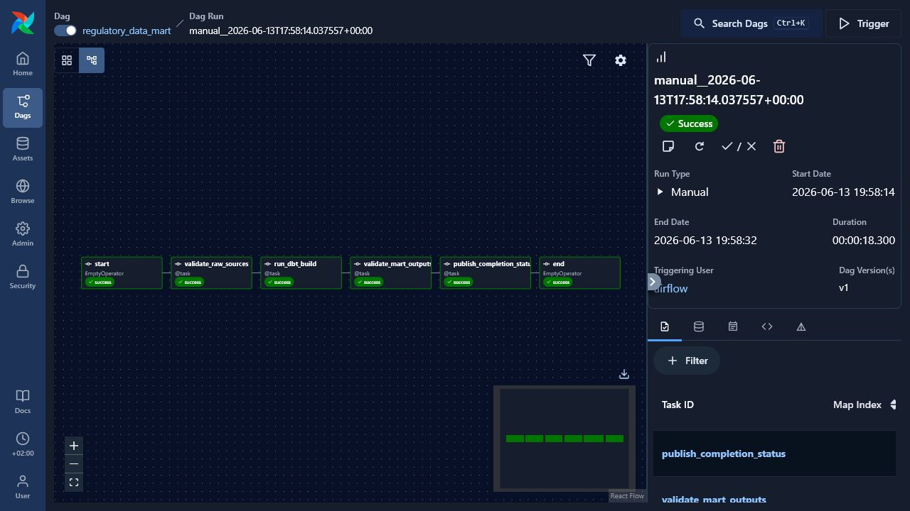
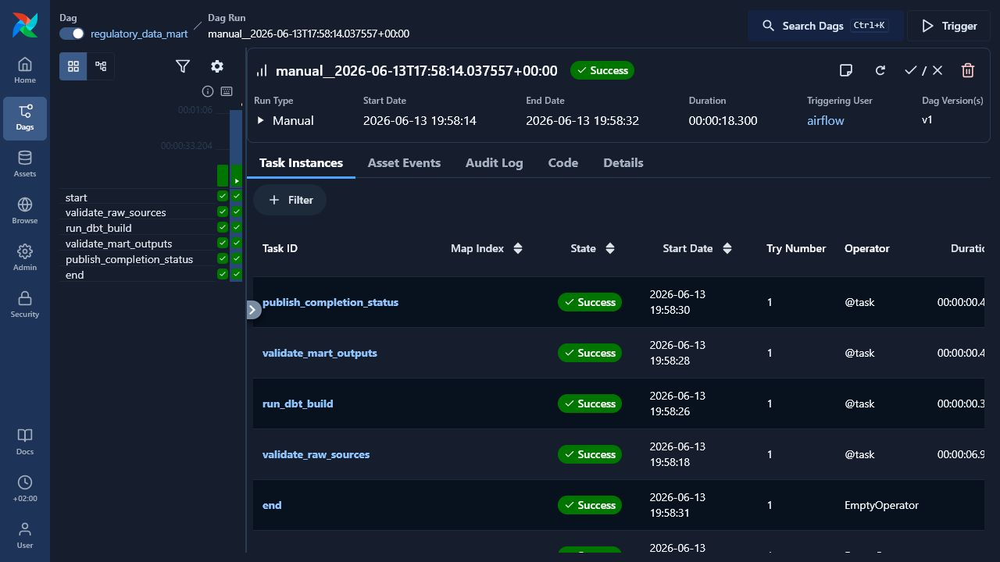

# AI-Ready Regulatory Data Mart

Portfolio project for a Senior Analytics Engineer role focused on regulatory reporting, data quality, dbt modeling, Snowflake warehousing, Airflow orchestration, Streamlit reporting, and GitHub CI.

The project turns raw operational extracts into governed reporting marts by legal entity, jurisdiction, and reporting month. It is designed to show how manual regulatory reporting work can be converted into reusable data infrastructure with clear ownership, tests, reconciliation, and AI-ready business definitions.

## Business Problem

Regulatory reporting teams need trusted answers to questions such as:

- What transaction volume is reportable by legal entity and jurisdiction?
- Which rows are ready for reporting, require review, or should be blocked?
- Do counts and settled volumes reconcile across raw, staging, core, and mart layers?
- Which metric definition should an analyst or AI assistant use when answering a regulatory question?

Manual pulls are slow, hard to audit, and easy to interpret differently across teams. This project models the reporting process as durable infrastructure.

## Solution Overview

The solution uses:

- Snowflake as the warehouse
- dbt for SQL transformations, tests, and model ownership
- Airflow for scheduled orchestration
- Streamlit for a self-serve reporting dashboard
- GitHub Actions for CI checks
- YAML and Markdown governance files for AI-ready metric definitions and data contracts



## Screenshots

### Streamlit Dashboard



### Data Quality View



### Snowflake Mart Tables

Snowflake screenshots are sanitized query-result captures generated from live Snowflake results with credentials and account identifiers omitted.



### Snowflake High-Value Cross-Border Metric



### Snowflake Reconciliation Status



### Airflow DAG Graph



### Airflow Successful Run



## Repository Structure

```text
.
|-- .github/
|   |-- workflows/
|   |   `-- ci.yml
|   `-- dbt_profiles/
|       `-- profiles.yml
|-- airflow/
|   |-- dags/
|   |   `-- regulatory_data_mart_dag.py
|   `-- docker/
|-- dashboard/
|   |-- streamlit_app.py
|   `-- regulatory_dashboard/
|-- data/
|   `-- raw/
|-- dbt/
|   |-- macros/
|   |-- models/
|   |   |-- staging/
|   |   |-- core/
|   |   `-- marts/
|   `-- dbt_project.yml
|-- docs/
|-- metrics/
|   |-- metric_definitions.yml
|   |-- data_contracts.yml
|   `-- ai_prompt_template.md
`-- warehouse/
    `-- snowflake/
```

## Data Modeling Approach

The dbt project follows a layered analytics engineering pattern:

| Layer | Purpose | Examples |
| --- | --- | --- |
| RAW | Source-aligned tables loaded into Snowflake | `RAW_TRANSACTIONS`, `RAW_CUSTOMERS` |
| STAGING | Cleaned, typed, source-specific models | `stg_transactions`, `stg_customers` |
| CORE | Reusable facts and dimensions | `fact_transaction`, `dim_customer_scd`, `dim_legal_entity` |
| OBT | One big table for self-serve analysis | `obt_regulatory_transaction` |
| MARTS | Business-ready reporting outputs | `mart_entity_monthly_regulatory_report`, `mart_dq_exception_summary`, `mart_reconciliation_status` |

The core layer uses a star-schema style design:

- `fact_transaction` stores transaction-grain measures and foreign keys
- `dim_customer_scd` stores point-in-time customer attributes
- `dim_legal_entity` stores entity-level reporting ownership
- `dim_jurisdiction` stores jurisdiction and risk flags

## Key dbt Models

### `mart_entity_monthly_regulatory_report`

Produces monthly regulatory reporting rows by:

- reporting month
- legal entity
- entity country
- jurisdiction

It calculates settled volume, transaction counts, active customers, high-risk customer activity, KYC review flags, and a reporting status of `PASS`, `REVIEW`, or `BLOCKED`.

### `mart_dq_exception_summary`

Summarizes data quality exceptions such as:

- missing customer
- missing legal entity
- missing jurisdiction
- duplicate transaction ID
- negative amount
- pending KYC
- rejected KYC
- high-risk jurisdiction

Each exception receives a severity of `REVIEW` or `BLOCKED`.

### `mart_reconciliation_status`

Compares transaction counts and settled volume across:

- raw source table
- staging model
- fact model
- OBT model
- final mart

This gives reporting users a clear signal on whether the mart is aligned with upstream data.

## Data Quality

dbt tests validate:

- primary keys are unique
- important fields are not null
- accepted values are controlled
- fact-to-dimension relationships are valid

The project also includes mart-level reconciliation logic so data quality is visible to business users, not hidden only in engineering logs.

## AI-Ready Governance Layer

The `metrics/` folder converts business logic into durable, machine-readable artifacts:

- `metric_definitions.yml` defines approved metric names, grains, filters, caveats, and review rules
- `data_contracts.yml` defines expected fields, accepted values, owners, and quality expectations
- `ai_prompt_template.md` defines guardrails for AI-assisted SQL and regulatory question answering

The design principle is that AI may assist with drafting SQL or explanations, but the mart, dbt tests, metric definitions, data contracts, reconciliation status, and human review remain the source of truth.

## Airflow Orchestration

The Airflow DAG is defined in:

```text
airflow/dags/regulatory_data_mart_dag.py
```

The DAG is scheduled daily and includes:

- start marker
- raw source validation hook
- dbt build task
- mart output validation hook
- completion status hook
- end marker

The portfolio version wires Airflow to run:

```bash
dbt build --target prod --profiles-dir /opt/airflow/dbt_profiles
```

In a production team, the validation hooks would be expanded into source freshness checks, row-count checks, reconciliation checks, and alerting.

## Streamlit Dashboard

The dashboard is defined in:

```text
dashboard/streamlit_app.py
```

It connects to Snowflake marts and gives users filters for:

- reporting month
- legal entity
- report status
- data quality severity

It shows:

- settled volume
- transaction count
- active customers
- blocked reporting rows
- report status distribution
- data quality exception summary
- reconciliation status
- metric definitions

## GitHub CI

The GitHub Actions workflow is defined in:

```text
.github/workflows/ci.yml
```

It runs on pushes to `main` and pull requests. The CI workflow checks:

- dbt project parsing
- dbt SQL compilation
- dashboard Python syntax

This is intentionally CI only. CD is not enabled for this portfolio because production deployment should be controlled through Snowflake credentials, environment approvals, and either Airflow or a manually triggered deployment workflow.

## How to Run Locally

### dbt

```powershell
cd C:\regulatory-data-mart-ai-ready\dbt
dbt debug --target dev --profiles-dir .
dbt build --target dev --profiles-dir .
```

### Streamlit

```powershell
cd C:\regulatory-data-mart-ai-ready
.\.venv\Scripts\Activate.ps1
streamlit run dashboard\streamlit_app.py
```

### Airflow

```powershell
cd C:\regulatory-data-mart-ai-ready\airflow\docker
docker compose up -d
```

