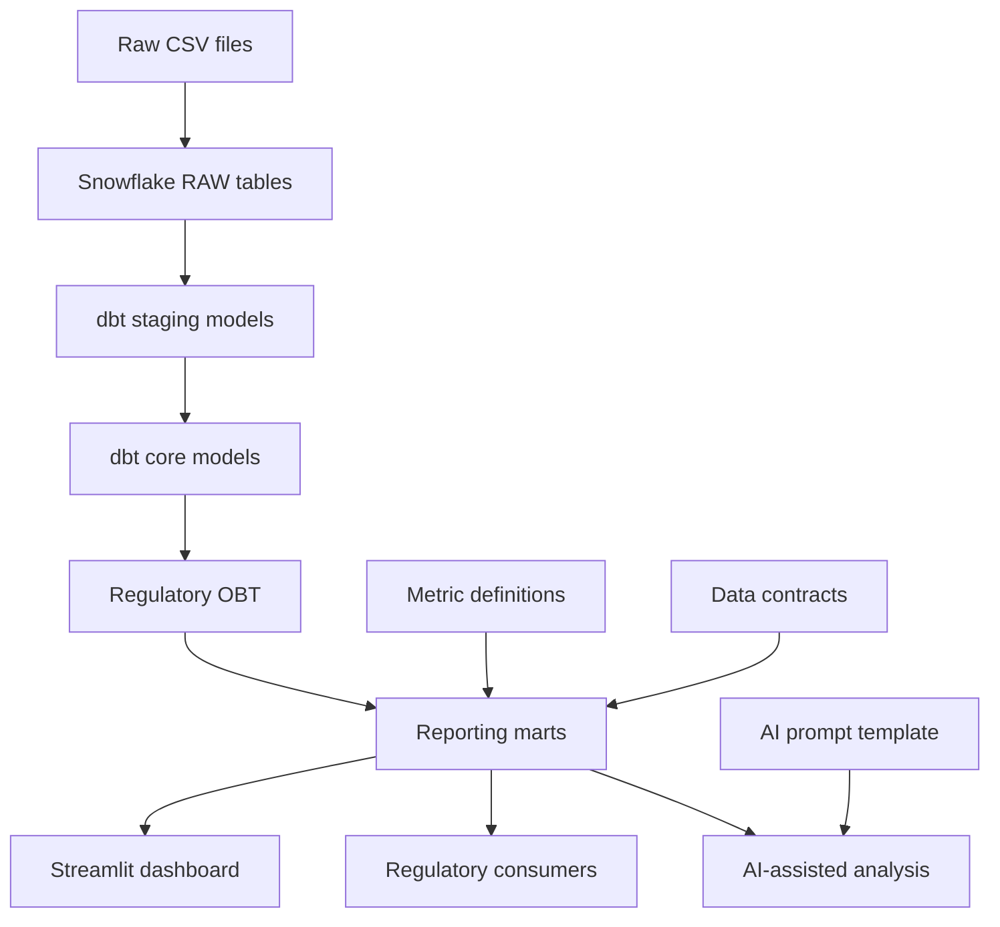

# Architecture

This project is organized like a small production analytics platform for regulatory reporting.

## System Flow



## Responsibilities

| Component | Responsibility |
| --- | --- |
| Snowflake | Stores raw, staging, core, and mart data |
| dbt | Owns transformations, tests, and model structure |
| Airflow | Orchestrates the scheduled dbt build |
| Streamlit | Presents self-serve reporting views |
| GitHub Actions | Runs CI checks before code is merged |
| Governance files | Define metric rules and AI guardrails |

## Environment Pattern

The project uses a dev/prod-style pattern:

- local development runs against developer-owned Snowflake schemas
- production-style models write to shared schemas
- credentials are kept outside Git
- CI uses a safe profile without hard-coded secrets

In a company environment, individual developers would typically have write access to dev schemas, while production updates would be executed by a controlled deployment role.

## Orchestration Pattern

Airflow is responsible for workflow timing and task ordering. dbt remains responsible for SQL transformations and tests.

```text
Airflow DAG
   -> validate raw source hook
   -> run dbt build
   -> validate mart output hook
   -> publish completion status
```

The portfolio DAG includes validation hooks to show where production checks would live. The dbt build task is the main transformation task.

