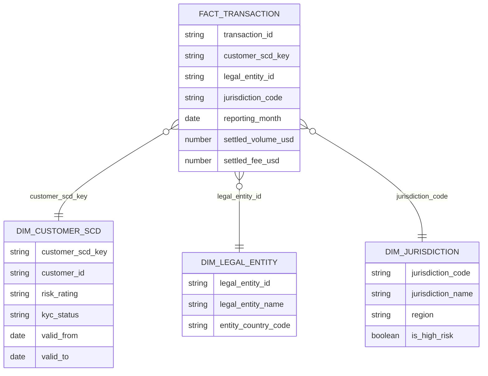

# Data Model

The data model is designed for entity-level regulatory reporting by month and jurisdiction.

## Layers

### RAW

The raw layer stores uploaded source extracts in Snowflake with minimal transformation.

Example raw tables:

- `RAW_TRANSACTIONS`
- `RAW_CUSTOMERS`
- `RAW_CUSTOMER_ENTITY_ASSIGNMENTS`
- `RAW_LEGAL_ENTITIES`
- `RAW_JURISDICTIONS`
- `RAW_REGULATORY_RULES`

### STAGING

The staging layer cleans source data into consistent names, types, and values.

Example staging models:

- `stg_transactions`
- `stg_customers`
- `stg_customer_entity_assignments`
- `stg_legal_entities`
- `stg_jurisdictions`
- `stg_regulatory_rules`

### CORE

The core layer creates reusable facts and dimensions.

| Model | Purpose |
| --- | --- |
| `dim_legal_entity` | One row per legal entity |
| `dim_jurisdiction` | One row per jurisdiction and risk flag |
| `dim_customer_scd` | Customer history and entity assignment context |
| `fact_transaction` | One row per transaction with reporting keys |
| `obt_regulatory_transaction` | Transaction-grain joined model for self-serve analysis |

## Star Schema

The star schema centers on `fact_transaction`.



## OBT

`obt_regulatory_transaction` is a transaction-grain one-big-table model. It joins facts and dimensions into a wide analysis table so analysts and dashboard users do not need to repeatedly write the same joins.

The OBT is not the final reporting mart. It is a reusable consumption model that simplifies downstream mart logic.

## MARTS

The mart layer produces business-ready outputs.

### `mart_entity_monthly_regulatory_report`

Grain:

```text
reporting_month + legal_entity_id + jurisdiction_code
```

Key outputs:

- total transactions
- settled transactions
- reportable settled volume USD
- settled fee USD
- active customer count
- high-risk customer count
- KYC exception counts
- report status

### `mart_dq_exception_summary`

Summarizes exception counts by month, entity, jurisdiction, rule, and severity.

Severity values:

- `REVIEW`
- `BLOCKED`

### `mart_reconciliation_status`

Compares counts and settled volume across raw, staging, fact, OBT, and mart layers.

Status values:

- `PASS`
- `REVIEW`
- `BLOCKED`

## Reporting Status Logic

The entity monthly report assigns:

| Status | Meaning |
| --- | --- |
| `PASS` | No modeled review or blocking condition |
| `REVIEW` | Pending KYC or high-risk jurisdiction activity exists |
| `BLOCKED` | Rejected KYC activity exists |

Final external reporting would still require human sign-off.

